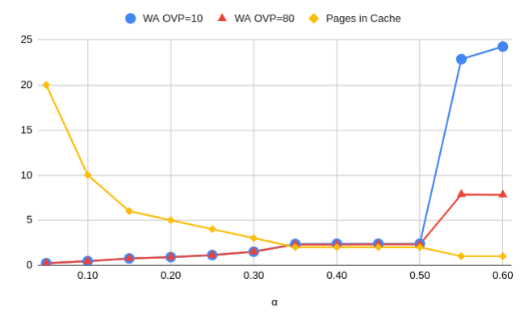

Problem Set 4
=============

Dry assignment / Intra-SSD Compression
---------------------------------------

### a

In this question we chose the following workload: we performed random page-aligned writes writing a total of 5 times the logical capacity of the drive.

We measured compression ratio $\alpha$ of 5% to 60% in 5% increments, for $OVP$ values of 10% and 80%. The results are presented below:



| $\alpha$ | WA OVP=10 | WA OVP=80 | Pages in Cache |
|----------|----------:|----------:|---------------:|
| 0.05     |    0.223  |  0.217    | 20             |
| 0.10     |    0.452  |  0.444    | 10             |
| 0.15     |    0.753  |  0.744    | 6              |
| 0.20     |    0.898  |  0.900    | 5              |
| 0.25     |    1.126  |  1.123    | 4              |
| 0.30     |    1.497  |  1.501    | 3              |
| 0.35     |    2.358  |  2.294    | 2              |
| 0.40     |    2.382  |  2.294    | 2              |
| 0.45     |    2.383  |  2.302    | 2              |
| 0.50     |    2.386  |  2.309    | 2              |
| 0.55     |    T/O    |  7.850    | 1              |
| 0.60     |    T/O    |  7.805    | 1              |


We can see two key points in the above data:

#. For both $OVP$ values, WA is inversely related to number of pages we can fit in the cache. (e.g. for $\alpha$ of 35% and 40% WA is the same, as same amount of pages can fit in the cache, yet we can see difference between 30% and 35%).
#. Both $OVP$ values behave the same, while workload writes less than physical volume of the SSD. Below is a brief sketch.

We'll denote

* physical volume of device $PV$
* logical volumes as $LV=PV\cdot 100 / (100 + OVP)=PV/f$.
* logcal volume written as $LW=5\cdot LV=5/f \cdot PV$.
* physical volume written  as $PW = \alpha\cdot LW = 5\alpha / f \cdot PV$.

From above we can see that *both* $OVP=10$ and $OVP$ write less than $PV$ for $\alpha \le 0.22$ and we indeed see that for those values WA is very similar. In fact due to randomness of the workload we can see almost similar performance up to $\alpha=0.30$.

For $0.35 \le \alpha \le 0.50$ we see slightly smaller WA on $OVP=80$, possibly due to bigger number of spare blocks.

### b


### c

A good garbage collection algorithm will strive to vacate the most space with least amount of IO. Without compression, picking block with most obsolete pages works because each page uses up the same amount of real-estate.

With compresstion enabled, pages take up variable sized chunks of the block. One block can have a lot of obsolete pages that do not page up a lot of space, while another block can have less obsolete pages that take up a lot of space. E.g.

```
"One block":
+-------+-------+---+---+---+---------+
|       |       |   |   |   |         |
|       |       | X | X | X |         |
|       |       |   |   |   |         |
+-------+-------+---+---+---+---------+

"Another block":
+-------+-------+---+---+-------------+
|       |       |   |   |             |
|       |   X   |   |   |     X       |
|       |       |   |   |             |
+-------+-------+---+---+-------------+
Invalid pages marked by X

```

We suggest to revise the garbage collection policy to prefer blocks where the sum of compressed sized of all valid pages is minimal. This way each eviction has to deal with less data and target block will have the most vacant space.

### d

Copyback command allows copy of data between 2 storage locations, without passing this data through the host (SSD controller in our case). This saves time - controller can perform other tasks, additionally, copyback commands can be parallelized if performed on disjoint physical resources.

Garbage collection requires copying data between blocks. Copyback speeds up this process because actual copying is off-loaded to the chips.

If compression mechanism is enabled, we might not be able to use copyback for all of our IO operations. In the no-compression case, we copy pages between blocks, and those pages are aligned to block boundaries. Once we enable compression, pages are no longer aligned. Copyback will be useful only in very specific cases where whole page is copied as is. E.g.:

```
Victim block

+----+-------+-----+----------+----+------+-----+
|    |       |     |          |    |      |     |
|    |       |     |     X    |    |   X  |  X  |
|    |       |     |          |    |      |     |
+----+-------+-----+---------------+------+-----+
#   #   #   #   #   #   #   # | #   #   #   # 
                              |
| Copyback range    | +-------+ Regular copy
                      |   
#   #   #   #   #   # | #   #   #   #   #   #
+----+-------+-----+--v-+-----------------------+
|    |       |     |    |                       |
|    |       |     |    |                       |
|    |       |     |    |                       |
+----+-------+-----+----+-----------------------+

Target block                   # <- Page boundary
```

In the example above, the first several pages can be copied directly with copyback because they are aligned and whole-pages. The last page cannot be copied with copyback and will have to be though the controller. This is however a very optimistic example, and for real workloads, we anticipate a very small percentage of pages to be copied with copyback.

### e

Trim operation will be performed in similar manned to uncompressed implementation - by invalidating the entry in the mappings. However, due to compression, we are no longer invalidating an entire page of flash, but rather a sub-page region (or two if page was stored cross-page boundary). Once page is marked as invalid, the above garbage collection mechanism will take care of recycling the space.

### f

Secure trim ensures data becomes unrecoverable, as such, to achieve secure trim, it not enough to unmap the page from the relevant mapping tables and mark the data as invalid.

One simple way to implement secure trim is to evict (and wipe) the whole block of the page. This ensures data will not be recoverable but also quite slow and wasteful (high WA).

Another, more efficient (yet more complex) way is to implement intra-SSD encryption. In this scheme, each page has some key (length depending on desired security level).
When page is written, a key is enrolled, stored, and page is encryped prior to writing to flash. When page is read, the key is retrieved, and page is decrypted.

Because our pages are compressed and of variable size, we can use a stream cipher and receive a more-or-less similarly sized ciphertext. One simple implementation for such cipher would be XORing with LFSR output, where key serves as initialization of the LFSR.

### g

In order to recover the data from our proposed drive, the following steps should be taken:

* Page mapping should be reconstructed, by reading the blocks dedicated to holding the mapping tables. (Inverse mappings are not required as we're not going to move pages).

* (If we implement per-page encryption) we'll need to read the encryption keys of the pages.

To read a specific page:

* Take the LBA of the page, and with the recovered mapping table retrieve `(PBA, offset, len)` of the page.
* Read `len` bytes from `PBA` at offset `offset`.
* Decrypt the page using key from recovered key table at `LBA` index.
* Decompress the decrypted key.

The page's data is now available.